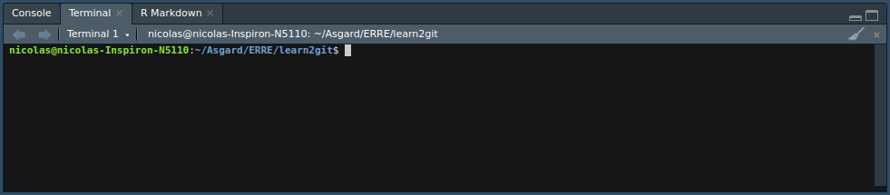

# Instalación Git

Es posible que ya tengas Git, pero instalar la última versión es una buena práctica y nos ahorrará problemas futuros.

## Instalación Windows y Mac

Pueden descargar el instalador de Git en:   

- MAC OS: <https://git-scm.com/download/mac>
- WINDOWS: <https://git-scm.com/download/win>  

Una vez descargado el archivo, pueden instalarlo como instalarían cualquier otro programa.

## Instalación Linux

Para instalar Git en Ubuntu deben ejecutar las siguientes lineas (una a la vez) en la terminal:  

```
sudo apt update
sudo apt install git
```

Para otras distribuciones Linux pueden visitar la siguiente página: <https://git-scm.com/download/linux>.

# Git y tu, el primer encuentro

Las acciones que realizar en Git quedan registradas junto con información sobre el autor de la acción, fecha y hora, además de un código identificador único en el caso de ``commits`` y ``merges``.

Para que Git sepa quien eres y pueda registrar acciones bajo tu nombre, es necesario decirle quién eres, junto con otra información. 

En la ``terminal`` de ``RStudio`` ejecuta (una a la vez) las siguientes lineas (substituye nombre e email con tu información; **Ojo que las comillas que envuelven el nombre e email deben ser conservadas**):

```
git config --global user.name 'Nicolas Sanchez'
git config --global user.mail 'nicolas.csanchez@gmail.com'  
git config --global --list  
```

Puedes acceder a la ``terminal`` desde ``RStudio`` en _Tools > Terminal > New Terminal_ o _Tools > Shell_.
<!-- Adicionalmente, si tienes Windows y tienes problemas con los comandos `git config` considera que existen distintos tipos de consolas y puede que estés en la incorrecta. En la barra superior debería decir `MSYS` o `MINGW64`, no `cmd.exe`. -->



Ten en cuenta que los commits que hagas llevarán el nombre de usuario que escojas, por lo que debería ser informativo para otras personas que trabajen contigo.

```{r, results='asis'}
knitr::include_graphics(paste0(getwd(), "/docs/non-plain/img/config_git.png"))
```


Las dos primeras lineas no imprimirán nada en la ``terminal`` (es decir, al ejecutarlas no recibirás una respuesta), la tercera linea (`git config --global --list`) imprimirá el nombre y correo electrónico que escogiste en las dos lineas anteriores (**Fig. 1.**).


